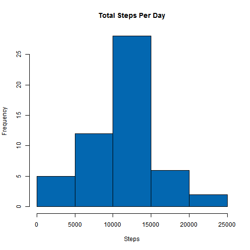
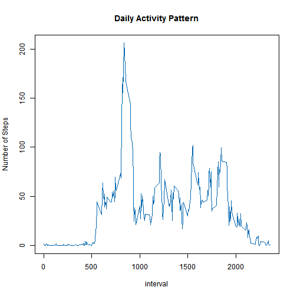
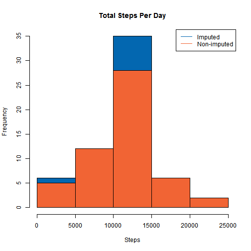
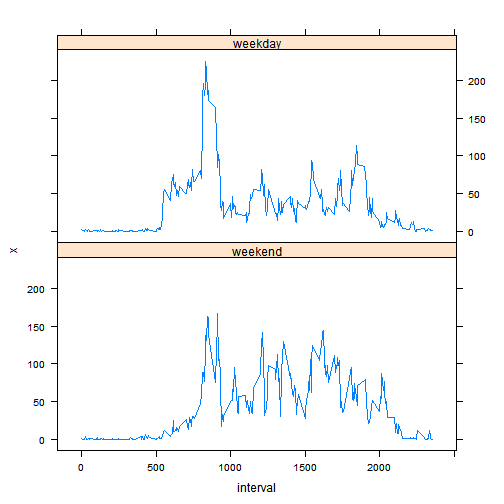

## Loading and preprocessing the data  

- Unzip and read csv into a variable called activity  
- Convert date column to date format
- Ignore step intervals with missing values  

```r
rawactivity <- read.csv(unz("activity.zip","activity.csv"),sep=",")   
rawactivity$date <- as.Date(rawactivity$date)
activity <- rawactivity[complete.cases(rawactivity),]
```
  
## What is mean total number of steps taken per day?  
1. Calculate the total steps per day  
2. Plot a histogram  
3. Calculate mean and median.  
  

```r
stepsPerDay <- aggregate(formula=(steps ~ date), data=activity, FUN=sum)

hist(stepsPerDay$steps, main="Total Steps Per Day", xlab="Steps", col="#0367B0")
```

 

```r
stepMean <- as.integer(mean(stepsPerDay$steps))
stepMedian <- median(stepsPerDay$steps)
```
The mean is **10766** and the median is **10765**.

## What is the average daily activity pattern?
Make a time series plot of the 5-minute interval and the average number of steps taken, averaged across all days

```r
avspi <- aggregate(formula=(steps ~ interval), data=activity, FUN=mean)
plot(avspi, type="l", main="Daily Activity Pattern", ylab="Number of Steps", col="#0367B0")
```

 

```r
maxAct <- avspi[which.max(avspi$steps),]
```

The 5-minute interval, on average across all the days in the dataset, which contains the maximum number of steps is **835**, with a maximum average number of steps of **206**.


## Imputing missing values

```r
missing <- rawactivity[is.na(rawactivity),]
nrow(missing)
```
The total number of rows in the dataset with NAs is **2304**  

The mean for respective 5-minute intervals can be used to fill in the missing data:

```r
imputed <- transform(rawactivity, steps=ifelse(is.na(rawactivity$steps), avspi$steps[match(rawactivity$interval, avspi$interval)], rawactivity$steps))
```

A rising trend occuring in the second day (2012-10-02) of the sample set suggest that the mean intervals used above would not be the best fit for day one (2012-10-01), hence missing values on 2012-10-01 can simply be filled instead  with steps=0:

```r
imputed[as.character(imputed$date)=="2012-10-01",1] <- 0
```

A histogram comparing the imputed total number of steps taken each day with the original:


```r
imputedStepsPerDay <- aggregate(formula=(steps ~ date), data=imputed, FUN=sum)
hist(imputedStepsPerDay$steps, main="Total Steps Per Day", xlab="Steps", col="#0367B0")

#compare with original histogram
hist(stepsPerDay$steps, main="Total Steps Per Day", xlab="Steps", col="#f16434", add=T)
legend("topright", c("Imputed", "Non-imputed"), col=c("#0367B0","#f16434"), lty=1)
```

 

```r
#calculate adjusted mean/median.
adjStepMean <- as.integer(mean(imputedStepsPerDay$steps))
adjStepMedian <- as.integer(median(imputedStepsPerDay$steps))

#calculate difference.
meanDiff <- adjStepMean - stepMean
medianDiff <- adjStepMedian - stepMedian

#calculate increased total number of steps
#adjStepsPerDay <- aggregate(formula=(steps ~ date), data=imputed, FUN=sum)
```

- The adjusted mean is **10589**, which, compared to the original estimated mean of **10766**, differs by **-177**
- The adjusted median is **10766**, which, compared to the original estimated median of **10765**, differs by **1**

The impact of imputing missing data on the estimates of the total daily number of steps is an increased total number of steps from **570608** to **645971**, an increase of **11** percent.


## Differences in activity patterns between weekdays and weekends?
1. Create a new factor variable in the dataset with two levels - "weekday"
and "weekend" indicating whether a given date is a weekday or weekend
day. 
2. A panel plot containing a time series plot of the 5-minute interval (x-axis) and the average number of steps taken, averaged across all weekday days or weekend days (y-axis).


```r
weekendDays <- c("Saturday","Sunday")
imputed$wkday <- factor((weekdays(imputed$date) %in% weekendDays),
                        levels=c(TRUE,FALSE),labels=c("weekend","weekday"))
```

```r
library(lattice)
averages <- aggregate(imputed$steps,
                      list(interval=imputed$interval,weekday=imputed$wkday),
                      FUN=mean)
xyplot(x~interval|weekday,averages, type="l", 
       ylabel="Number of Steps", layout=c(1,2))
```

 
